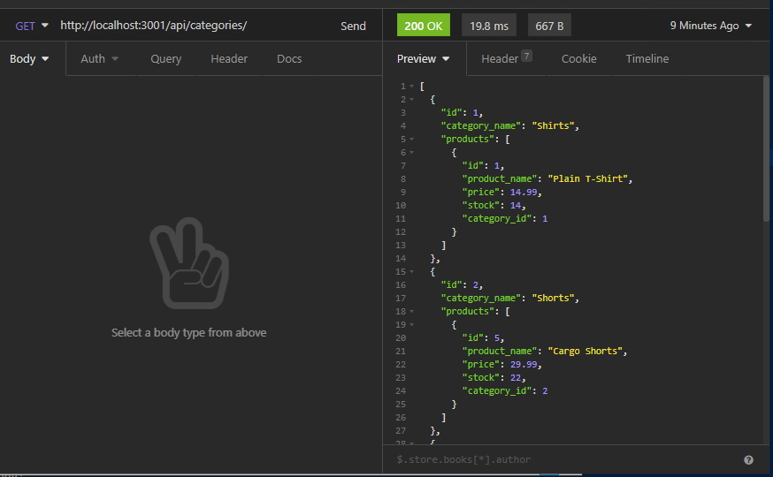

# Store Database &copy;

## Description 

A refactor where I created and seeded a store database.

## Table of Contents (Optional)

If your README is very long, add a table of contents to make it easy for users to find what they need.

* [Installation](#installation)
* [Usage](#usage)
* [License](#license)

## Installation

1. Clone repository
2. Extract from Zip
3. Run npm install

## Usage 

1. Open command prompt to root file
2. Open MySQL shell
3. Run source db/schema.sql
4. Run quit
5. Run node seeds/index.js
6. Run node server.js
7. Access through Insomnia Core 

Walkthrough Video

[Example Video](https://youtu.be/Qo_TnXb8mxE)

## License

Copyright 2021 &copy;